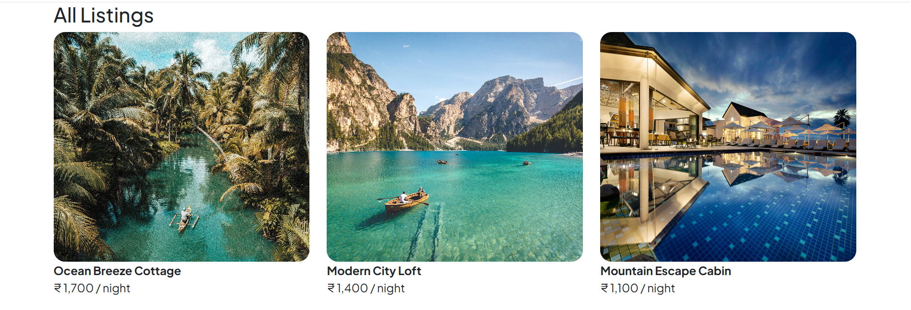
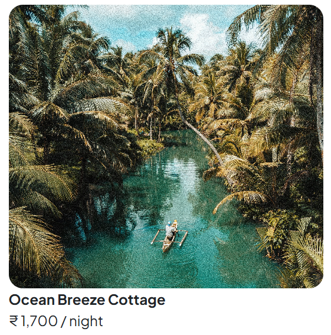
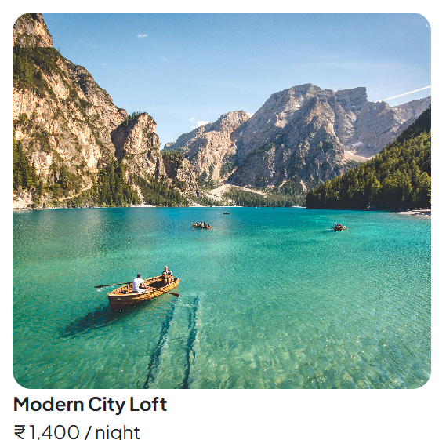
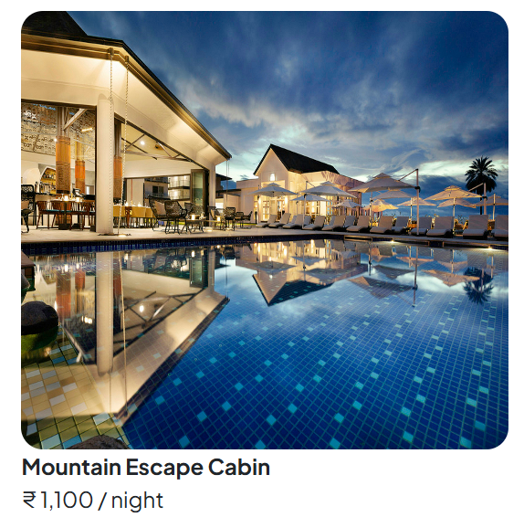

<div align="center">

# 🏠 Mini-BnB

### A full-stack vacation rental listing platform inspired by Airbnb


<br/>

[](https://nodejs.org/)
[](https://expressjs.com/)
[](https://www.mongodb.com/)
[](https://ejs.co/)
[](https://github.com/motdotla/dotenv)

</div>

---

## 📸 Screenshots  

<div align="center">

### 🗂️ All Listings Page  


> Browse all available vacation rentals with beautiful card layouts featuring images, titles, and per-night pricing.

<br/>

### 🏡 Featured Properties  

<table>
  <tr>
    <th>Ocean Breeze Cottage</th>
    <th>Modern City Loft</th>
    <th>Mountain Escape Cabin</th>
  </tr>
  <tr>
    <td></td>
    <td></td>
    <td></td>
  </tr>
  <tr>
    <td align="center">₹1,700 / night</td>
    <td align="center">₹1,400 / night</td>
    <td align="center">₹1,100 / night</td>
  </tr>
</table>

</div>
---

## ✨ Features

- 📋 **View All Listings** — Browse all vacation rental properties in a responsive grid
- ➕ **Add New Listing** — Submit new properties with title, description, image, price, location & country
- 🔍 **View Listing Details** — Detailed show page for each individual property
- ✏️ **Edit Listings** — Update any existing listing's information
- 🗑️ **Delete Listings** — Remove listings permanently
- 🗄️ **MongoDB Integration** — Persistent data storage with Mongoose ODM
- 🔁 **RESTful Routes** — Clean, conventional REST API structure

---

## 🛠️ Tech Stack

| Technology | Purpose | Link |
|---|---|---|
| [](https://nodejs.org/) | JavaScript runtime environment | [nodejs.org](https://nodejs.org/) |
| [](https://expressjs.com/) | Web application framework | [expressjs.com](https://expressjs.com/) |
| [](https://www.mongodb.com/) | NoSQL database | [mongodb.com](https://www.mongodb.com/) |
| [](https://mongoosejs.com/) | MongoDB object modeling | [mongoosejs.com](https://mongoosejs.com/) |
| [](https://ejs.co/) | Templating engine | [ejs.co](https://ejs.co/) |
| [](https://github.com/JacksonTian/ejs-mate) | EJS layout support | [github.com](https://github.com/JacksonTian/ejs-mate) |
| [](https://github.com/motdotla/dotenv) | Environment variables | [github.com](https://github.com/motdotla/dotenv) |
| [](https://github.com/expressjs/method-override) | HTTP verb support (PUT/DELETE) | [github.com](https://github.com/expressjs/method-override) |

---

## 📁 Project Structure
 
```
DB-Project-1/
├── init/                          # Database initialization scripts
├── models/                        # Mongoose models
├── pics/                          # Project images / assets
├── public/
│   └── css/
│       └── style.css              # Global stylesheet
├── views/
│   ├── includes/
│   │   ├── navbar.ejs             # Navbar partial
│   │   └── footer.ejs             # Footer partial
│   ├── layouts/
│   │   └── boilerplate.ejs        # EJS-Mate layout wrapper
│   └── listings/
│       ├── index.ejs              # All listings page
│       ├── show.ejs               # Individual listing detail page
│       ├── new.ejs                # Add new listing form
│       └── edit.ejs               # Edit listing form
├── .env                           # Environment variables (not committed)
├── .gitignore                     # Git ignored files
├── index.js                       # Main application entry point
├── index.txt                      # Notes / reference file
├── package.json                   # Project metadata & scripts
└── package-lock.json              # Dependency lock file
```
 
---

## 🚀 Getting Started

### Prerequisites

Make sure you have the following installed:

- [Node.js](https://nodejs.org/) (v14 or higher)
- [MongoDB](https://www.mongodb.com/) (local or Atlas)
- [npm](https://www.npmjs.com/)

### Installation

1. **Clone the repository**
   ```bash
   git clone https://github.com/vighnesh204/mini-bnb.git
   cd mini-bnb
   ```

2. **Install dependencies**
   ```bash
   npm install
   ```

3. **Set up environment variables**

   Create a `.env` file in the root directory:
   ```env
   MONGO_URL=mongodb://localhost:27017/mini-bnb
   PORT=8080
   ```

4. **Start the server**
   ```bash
   node index.js
   ```

5. **Open in browser**
   ```
   http://localhost:8080/listings
   ```

---

## 🔗 API Routes

| Method | Route | Description |
|--------|-------|-------------|
| `GET` | `/listings` | View all listings |
| `GET` | `/listings/new` | Form to create a new listing |
| `POST` | `/listings` | Create a new listing |
| `GET` | `/listings/:id` | View a single listing |
| `GET` | `/listings/:id/edit` | Form to edit a listing |
| `PUT` | `/listings/:id` | Update a listing |
| `DELETE` | `/listings/:id` | Delete a listing |

---

## 📦 Dependencies

```json
{
  "express": "^4.x",
  "mongoose": "^7.x",
  "ejs": "^3.x",
  "ejs-mate": "^4.x",
  "method-override": "^3.x",
  "dotenv": "^16.x"
}
```

Install all at once:
```bash
npm install express mongoose ejs ejs-mate method-override dotenv
```

---

## 🌐 Environment Variables

| Variable | Description | Example |
|----------|-------------|---------|
| `MONGO_URL` | MongoDB connection string | `mongodb://localhost:27017/mini-bnb` |
| `PORT` | Port number for the server | `8080` |

---

## 🤝 Contributing

Contributions are welcome! Feel free to open an issue or submit a pull request.

1. Fork the project
2. Create your feature branch (`git checkout -b feature/AmazingFeature`)
3. Commit your changes (`git commit -m 'Add some AmazingFeature'`)
4. Push to the branch (`git push origin feature/AmazingFeature`)
5. Open a Pull Request

---

## 📄 License

This project is open source and available under the [MIT License](LICENSE).

---

<div align="center">

Made with ❤️ | Inspired by [Airbnb](https://www.airbnb.com/)

⭐ Star this repo if you found it helpful!

</div>